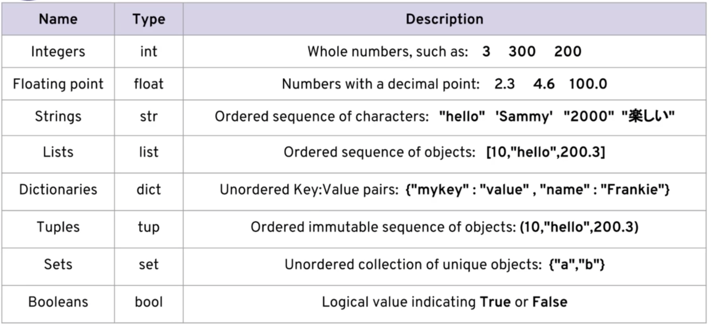

# 1. Setup

If you already have Python, pip and virtual environments set up you can skip this step.

## Verify if you have python 3 installed

You can try both `python --version` or `python3 --version`

### Download and Install python 3

1. You can find a [Python 3.10](https://www.python.org/downloads/release/python-3100/) download suitable for your system.
2. Using homebrew on a MacOS system `brew install python`

### Install the python package manager pip
This is the package manager used for python (like maven or gradle)
1.  `python3 -m pip install -U --force-reinstall pip`

## Setting up virtual environment and installing dependencies

To prevent packages / project dependencies from being installed for all your projects a virtual environment is required.
This virtual environment is a fresh python install with no other libraries installed. 
This helps prevent version conflicts between your projects (project A might use version 1 and project B might use version 2 of the same library)

### Steps

1. Install virtualenv with the pip package manager `pip install virtualenv`
2. verify your installation `virtualenv --version`
3. Go to the project root `cd kata-python`
4. Create the virtual environment `virtualenv venv` (the name venv can be anything however it is common practice to use venv)
5. Switch to the virtual environment `source venv/bin/activate`
6. Install all packages in the requirements.txt file `python3 -m pip install -r requirements.txt`

# 2. Python basics

If you already know the basics of python you can skip this section and start the Kata.

## Python basics cheat sheet


### Data types



### Lists
my_list = [1,2,3]
my_list = ['A string', 23 , 100.232, 'o']
- `len(my_list)` => 4

my_list = ['one','two','three',4,5]
- `my_list[0]` => 'one'
- `my_list[1:]` => ['two', 'three', 4, 5]
- `my_list[:3]` => ['one', 'two', 'three']
- `my_list + ['new item']` => ['one', 'two', 'three', 4, 5, 'new item']
- `my_list` => ['one', 'two', 'three', 4, 5]
- `my_list = my_list + ['add new item permanently']`
- `my_list` => ['one', 'two', 'three', 4, 5, 'add new item permanently']

list1 = [1,2,3]
- `list1.append('append me!')`
- `list1` => [1, 2, 3, 'append me!']
- `list1.reverse()`
- `list1` => ['append me!', 3, 2, 1]
- `list1.pop(0)`
- `list1` => [3, 2, 1]
- `list1.sort()`
- `list1` => [1, 2, 3]


### Dictionaries

`my_dict = {'key1':'value1','key2':'value2'}`
- `my_dict['key2']` => 'value2'

`my_dict = {'key1':123,'key2':[12,23,33],'key3':['item0','item1','item2']}`
- `my_dict['key3']` => ['item0','item1','item2']
- `my_dict['key3'][0]` => 'item0'
- `my_dict['key1'] = my_dict['key1'] - 123` => 0

```
d = {}
d['animal'] = 'Dog'
d['answer'] = 42
```
- `d` => {'animal': 'Dog', 'answer': 42}
- `d.keys()` => dict_keys(['animal', 'answer'])
- `d.values()` => dict_values(['Dog', 42])
- `d.items()` => dict_items([('animal', 'Dog'), ('answer', 42)])

### Tuples
`t = ('one',2)`
- `t` =>  ('one',2)
- `t[0]` => 'one'
- `t[0] = 'change'` => TypeError: 'tuple' object does not support item assignment
- `t.append('nope')` => AttributeError: 'tuple' object has no attribute 'append'

### Sets
`x = set()`
- `x.add(1)`
- `x` => {1}
- `x.add(2)`
- `x` => {1, 2}
- `x.add(1)`
- `x` => {1, 2}

`list1 = [1,1,2,2,3,4,5,6,1,1]`
- `set(list1)` => {1, 2, 3, 4, 5, 6}

### Booleans - “and/or/not” keywords

`2 <= 2 and 2 < 3` => True
`1 == 1 or 100 == 1` => True
`not 1 == 1` => False

### “in” keyword

`list1 = [1,2,3]`

```
for num in list1:
    print(num)
    
for letter in 'This is a string.':
    print(letter)
```

`tup = (1, 2, 3, 4, 5)`
```
for t in tup:
    print(t)
```

`list2 = [(2, 4), (6, 8), (10, 12)]`
```
for tup in list2:
    print(tup)
for (t1, t2) in list2:
    print(t1)
```

`d = {'k1': 1, 'k2': 2, 'k3': 3}`
```
for k, v in d.items():
    print(k)
    print(v)
```

### *args = tuple, **kwargs = dict
```
def myfunc(*args):
   return sum(args) * .05

myfunc(40, 60, 20)
6.0 

def myfunc(**kwargs):
   if 'fruit' in kwargs:
       print(f"My favorite fruit is {kwargs['fruit']}")  # review String Formatting and f-strings if this syntax is unfamiliar

myfunc(fruit='pineapple')
My favorite fruit is pineapple
```

### zip generator

```
x = [1, 2, 3]
y = [4, 5, 6]

# Zip the lists together
list(zip(x, y))

[(1, 4), (2, 5), (3, 6)]
```

### enumarate() generator

```
lst = ['a', 'b', 'c']

for number, item in enumerate(lst):
   print(f'{number} - {item}')

0 - a
1 - b
2 - c
```

### Custom generator

```
# Generator function for the cube of numbers (power of 3)
def gencubes(n):
   for num in range(n):
       yield num**3

for x in gencubes(10):
   print(x)
```

### if / elif / else
```
person = 'John'
if person == 'Sammy':
    print('Welcome Sammy!')
elif person =='George':
    print('Welcome George!')
else:
    print("Welcome, what's your name?")
```

### Object oriented
```
class Card:

   def __init__(self, suit, rank):
       self.suit = suit
       self.rank = rank

   def __str__(self):
       return self.rank + ' of ' + self.suit
```

### NumPy Arrays

```
import numpy as np

random = np.random.rand(5, 5)
random.max()
random.min()

np.sqrt(random)
np.sin(random)
np.log(random)
```

my_list = [1, 2, 3]
```
print(np.array(my_list))
print(np.zeros(3))
print(np.ones((3,3)))
[1 2 3]
[0. 0. 0.]
[[1. 1. 1.]
[1. 1. 1.]
[1. 1. 1.]]
```

print(np.random.rand(5, 5))
```
[[0.60762853 0.96551744 0.68542733 0.88297075 0.84795061]
[0.43626265 0.77330713 0.24258938 0.49060494 0.07266296]
[0.84188574 0.85882274 0.96759511 0.64594991 0.6397208 ]
[0.07042926 0.18346292 0.37564805 0.87762906 0.02559871]
[0.83707347 0.68878832 0.69812028 0.59070264 0.7337329
```

### Pandas

```
import pandas as pd
import numpy as np
from numpy.random import randn
np.random.seed(101)
df = pd.DataFrame(randn(5, 4), index='A B C D E'.split(), columns='W X Y Z'.split())
print(df)
          W         X         Y         Z
A  2.706850  0.628133  0.907969  0.503826
B  0.651118 -0.319318 -0.848077  0.605965
C -2.018168  0.740122  0.528813 -0.589001
D  0.188695 -0.758872 -0.933237  0.955057
E  0.190794  1.978757  2.605967  0.683509
```


# 3. The Kata - Blackjack (Object Oriented)

In this kata project you will be creating a Complete BlackJack Card Game in Python.

Here are the requirements:

* You need to create a simple text-based [BlackJack](https://en.wikipedia.org/wiki/Blackjack) game
* The game needs to have one player versus an automated dealer.
* The player can stand or hit.
* The player must be able to pick their betting amount.
* You need to keep track of the player's total money.
* You need to alert the player of wins, losses, or busts, etc...

Additionally:

* **You can use OOP and classes in some portion of your game. Use classes to help you define the Deck and the Player's hand. There are many right ways to do this, so explore it well!**

Feel free to expand this game. Try including multiple players. Try adding in Double-Down and card splits! Remember to you are free to use any resources you want.

https://nl.wikipedia.org/wiki/Blackjack

## Game Play

To play a hand of Blackjack the following steps must be followed:

1. Create a deck of 52 cards
2. Shuffle the deck
3. Ask the Player for their bet
4. Make sure that the Player's bet does not exceed their available chips
5. Deal two cards to the Dealer and two cards to the Player
6. Show only one of the Dealer's cards, the other remains hidden
7. Show both of the Player's cards
8. Ask the Player if they wish to Hit, and take another card
9. If the Player's hand doesn't Bust (go over 21), ask if they'd like to Hit again.
10. If a Player Stands, play the Dealer's hand. The dealer will always Hit until the Dealer's value meets or exceeds 17
11. Determine the winner and adjust the Player's chips accordingly
12. Ask the Player if they'd like to play again

## Class Definitions
Consider making a Card class where each Card object has a suit and a rank, then a Deck class to hold all 52 Card objects, and can be shuffled, and finally a Hand class that holds those Cards that have been dealt to each player from the Deck.

